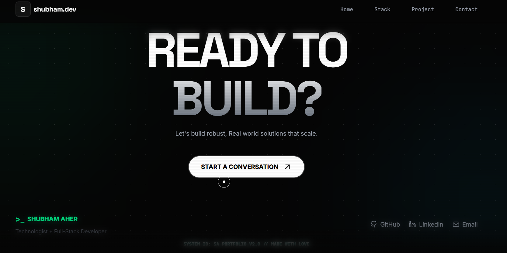

# Student Portfolio

A modern, interactive portfolio website to showcase skills, projects, and professional achievements.

## Live Demo

[](https://shubham-aher.vercel.app/)

[](https://shubham-aher.vercel.app/)

## Portfolio Screenshots

<table>
  <tr>
    <td align="center">
      
      <br/>
      <b>Landing View</b>
    </td>
    <td align="center">
      
      <br/>
      <b>Closing View</b>
    </td>
  </tr>
</table>


## Features

- **Dynamic Hero Section:** Animated introduction with resume download.
- **Contact Form:** Secure, Web3Forms-powered messaging.
- **Responsive Design:** Optimized for all devices.
- **Smooth Animations:** Powered by Framer Motion.


## Technology Stack

**Frontend:**
- React 19 (with hooks & concurrent features)
- TypeScript
- Vite
- Tailwind CSS
- Framer Motion

##  Prerequisites

- Node.js v16 or higher
- npm or yarn


## Getting Started

1. **Clone the repository**
  ```bash
  git clone https://github.com/shubhamaher8/shubham-aher-portfolio.git
  cd shubham-aher-portfolio
  ```

2. **Install dependencies**
  ```bash
  npm install
  ```

3. **Start the development server**
  ```bash
  npm run dev
  ```

4. **Open your browser**
  Visit [http://localhost:3000](http://localhost:3000)


## Project Structure

```
Student-Portfolio/
├── public/
├── components/
│   ├── ui/
│   │   └── CustomCursor.tsx
│   ├── Contact.tsx
│   ├── Footer.tsx
│   ├── Header.tsx
│   ├── Hero.tsx
│   ├── Preloader.tsx
│   ├── Projects.tsx
│   ├── StatsGrid.tsx
│   └── TerminalConsole.tsx
├── App.tsx
├── index.tsx
├── index.html
├── package.json
├── tsconfig.json
├── vite.config.ts
└── README.md
```


## Design Principles

- **Dark Theme:** Cyberpunk-inspired with neon accents.
- **Performance:** Optimized animations, lazy loading.
- **Accessibility:** Semantic HTML, keyboard navigation.


## Contributing

Contributions and suggestions are welcome! To contribute:

1. Fork the repository
2. Create a feature branch
3. Submit a pull request

## License

This project is licensed under the MIT License. See the [LICENSE](LICENSE) file for details.